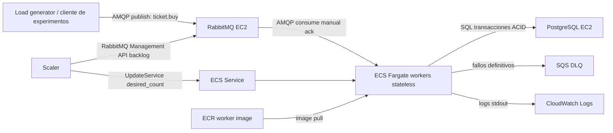

# Arquitectura de infraestructura - Ticket Service AWS Academy

Fecha: 2026-06-07
Estado: infraestructura base implementada y validada con Terraform. Los recursos quedan desactivados por defecto para evitar coste accidental.

## 1. Objetivo de la arquitectura

La practica pide un sistema distribuido de venta de tickets que cumpla tres propiedades principales:

- Correccion bajo concurrencia: no vender mas tickets de los disponibles y no vender el mismo asiento dos veces.
- Elasticidad: poder aumentar o reducir workers segun carga real.
- Medicion fiable: medir peticiones completadas, latencias y backlog, no solo tiempos del cliente.

La arquitectura se basa en comunicacion asincrona con RabbitMQ, workers stateless en ECS Fargate y persistencia transaccional en PostgreSQL.

## 2. Diagrama general



## 3. Componentes

### Terraform

Terraform es la fuente declarativa de infraestructura.

Archivos relevantes:

- `infra/terraform/providers.tf`: provider AWS y tags comunes.
- `infra/terraform/main.tf`: lectura de cuenta, region, VPC default y subnets default.
- `infra/terraform/core_infra.tf`: infraestructura base real.
- `infra/terraform/fargate_smoke.tf`: prueba temporal ya validada de ECR + Fargate.
- `infra/terraform/smoke.tf`: prueba temporal SQS.
- `infra/terraform/outputs.tf`: endpoints, credenciales sensibles y URLs necesarias.
- `infra/terraform/variables.tf`: flags de activacion y parametros.

La infraestructura real esta protegida por:

```hcl
enable_core_infra = false
```

Para crearla explicitamente:

```powershell
terraform apply -var enable_core_infra=true -var operator_cidr=<TU_IP>/32
```

Para destruirla:

```powershell
terraform destroy -var enable_core_infra=true -var operator_cidr=<TU_IP>/32
```

### VPC y subnets

Se usa la VPC default de AWS Academy:

```text
vpc-0b379683405b06ceb
```

Motivo:

- Reduce complejidad.
- Evita crear NAT Gateways, que consumen presupuesto.
- Las subnets default tienen salida a Internet y public IP on launch.
- Es suficiente para la practica y para desplegar Fargate con `assign_public_ip=true`.

### RabbitMQ en EC2

RabbitMQ es la cola principal obligatoria del enunciado.

Implementacion:

- EC2 Amazon Linux 2023.
- Docker instalado por user data.
- Contenedor `rabbitmq:3-management`.
- Usuario: `ticket_user`.
- Password: generada por Terraform `random_password`.
- Puerto AMQP: `5672`.
- Puerto management UI: `15672`.

Recursos RabbitMQ creados por user data:

```text
exchange: tickets.exchange
exchange type: direct
queue: tickets.buy
routing key: ticket.buy
```

Funcion en el sistema:

- Recibe mensajes de compra desde el generador de carga.
- Desacopla productores y workers.
- Permite absorber picos mediante backlog.
- Permite escalar workers segun mensajes pendientes.
- Entrega mensajes con semantica at-least-once.

Punto importante:

RabbitMQ no es la fuente de verdad. Puede reentregar mensajes. La correccion se garantiza en PostgreSQL con idempotencia y transacciones.

### PostgreSQL en EC2

PostgreSQL es la fuente de verdad.

Implementacion:

- EC2 Amazon Linux 2023.
- Docker instalado por user data.
- Contenedor `postgres:16-alpine`.
- Base de datos: `tickets`.
- Usuario: `ticket_user`.
- Password: generada por Terraform `random_password`.
- Puerto: `5432`.

Tablas principales:

```text
experiment_runs
requests
ticket_pools
seats
sales
```

Inicializacion:

- `ticket_pools` contiene el pool `main` con `100000` tickets.
- `seats` contiene asientos `1..100000` con estado `available`.

Funcion en el sistema:

- Decide si una compra se completa o se rechaza.
- Impide overselling.
- Registra requests completadas para throughput y latencia.
- Permite calcular p50, p95, p99 con datos de transacciones completadas.

Garantias usadas:

- Transacciones ACID.
- `request_id` unico para idempotencia.
- `seat_id` unico en ventas numeradas.
- `CHECK (sold_count <= total_tickets)` en tickets no numerados.
- Actualizaciones condicionales `WHERE status = 'available'` y `WHERE sold_count < total_tickets`.

### ECS Fargate workers

Los workers son stateless.

Estado actual:

- Fargate ya fue validado con un smoke test real.
- La imagen minima arranco correctamente y escribio logs en CloudWatch.
- El worker real ya esta implementado en `app/worker/src/worker.py`.
- La integracion Terraform definitiva del ECS Service real es el siguiente paso.

Funcion del worker real:

1. Consume mensajes de RabbitMQ `tickets.buy` con manual ack.
2. Valida payload JSON.
3. Aplica delay artificial de `100 ms` dentro de la logica de procesamiento.
4. Ejecuta transaccion PostgreSQL.
5. Si la transaccion confirma, hace `ack` en RabbitMQ.
6. Si hay error transitorio, republish con header `x-attempt` incrementado.
7. Si supera `MAX_ATTEMPTS`, envia el mensaje a SQS DLQ.

Variables principales:

```text
RABBITMQ_HOST
RABBITMQ_PORT
RABBITMQ_USER
RABBITMQ_PASSWORD
RABBITMQ_EXCHANGE
RABBITMQ_QUEUE
RABBITMQ_ROUTING_KEY
POSTGRES_HOST
POSTGRES_PORT
POSTGRES_DB
POSTGRES_USER
POSTGRES_PASSWORD
SQS_DLQ_URL
WORKER_PREFETCH
MAX_ATTEMPTS
PAYMENT_DELAY_MS
```

### ECR

ECR almacena la imagen Docker del worker.

Repositorio definido:

```text
ticket-service-worker
```

Funcion en el sistema:

- Docker build genera la imagen del worker.
- Docker push sube la imagen a ECR.
- ECS Fargate descarga la imagen desde ECR al arrancar tasks.

Nota practica de PowerShell:

El login con pipe puede fallar en este entorno. Funciono usando password en variable:

```powershell
$pass = aws ecr get-login-password --region us-east-1
docker login --username AWS --password $pass 065586234233.dkr.ecr.us-east-1.amazonaws.com
```

### SQS DLQ

SQS no sustituye a RabbitMQ. Se usa solo como Dead Letter Queue de fallos definitivos.

Cola definida:

```text
ticket-service-academy-ticket-failures-dlq
```

Funcion:

- Recibe mensajes malformados.
- Recibe mensajes que superan `MAX_ATTEMPTS`.
- Permite auditar fallos sin bloquear la cola principal.

Configuracion:

```text
SSE managed by SQS: enabled
Retention: 14 dias
```

### CloudWatch Logs

CloudWatch Logs se usa para observar workers Fargate.

Validado en smoke test:

```text
smoke-worker started env=academy
smoke-worker heartbeat
```

En el sistema final registrara:

- Inicio de workers.
- Requests procesadas.
- Resultados `sold`, `sold_out`, `seat_unavailable`.
- Retries.
- Envios a DLQ.
- Errores transitorios.

## 4. Seguridad y reglas de comunicacion

### Security group de workers

Inbound:

```text
ninguno
```

Outbound:

```text
0.0.0.0/0
```

Motivo:

Los workers no reciben trafico entrante. Solo salen hacia RabbitMQ, PostgreSQL, SQS, ECR y CloudWatch.

### Security group de RabbitMQ

Inbound:

```text
5672 desde workers SG
5672 desde operator_cidr para load generator local
15672 desde operator_cidr para UI/API de gestion
```

Outbound:

```text
0.0.0.0/0
```

Motivo:

- Workers consumen AMQP por red privada.
- El operador puede publicar carga desde local durante pruebas.
- La UI no queda abierta a Internet, solo a la IP del operador.

### Security group de PostgreSQL

Inbound:

```text
5432 desde workers SG
5432 desde operator_cidr para debug/export de metricas
```

Outbound:

```text
0.0.0.0/0
```

Motivo:

PostgreSQL solo debe ser accesible por workers y por el operador durante pruebas.

## 5. Flujo de compra

### Mensaje esperado

```json
{
  "request_id": "uuid",
  "run_id": "uuid",
  "mode": "numbered",
  "seat_id": 123,
  "enqueued_at": "2026-06-07T17:00:00Z"
}
```

Para tickets no numerados:

```json
{
  "request_id": "uuid",
  "run_id": "uuid",
  "mode": "unnumbered",
  "enqueued_at": "2026-06-07T17:00:00Z"
}
```

### Flujo detallado

1. El generador publica el mensaje en `tickets.exchange` con routing key `ticket.buy`.
2. RabbitMQ enruta el mensaje a `tickets.buy`.
3. Un worker Fargate consume el mensaje.
4. El worker valida JSON, UUIDs, modo y asiento.
5. El worker abre una transaccion PostgreSQL.
6. El worker crea o reutiliza el `experiment_run`.
7. El worker crea o reutiliza la fila `requests` por `request_id`.
8. El worker bloquea la fila de request con `FOR UPDATE`.
9. Si la request ya esta `completed` o `failed`, devuelve resultado idempotente.
10. El worker incrementa `attempts` y marca `worker_started_at`.
11. El worker espera `100 ms` para simular pago externo.
12. Si es no numerado, ejecuta `UPDATE ticket_pools ... WHERE sold_count < total_tickets`.
13. Si es numerado, ejecuta `UPDATE seats ... WHERE status = 'available'`.
14. Si hay venta, inserta en `sales`.
15. Actualiza `requests` con `completed_at` y `result`.
16. Commit.
17. Solo despues del commit, hace `ack` en RabbitMQ.

## 6. Correctness bajo concurrencia

### Tickets no numerados

Operacion clave:

```sql
UPDATE ticket_pools
SET sold_count = sold_count + 1
WHERE pool_id = 'main'
  AND sold_count < total_tickets
RETURNING sold_count;
```

Por que funciona:

- PostgreSQL serializa updates concurrentes sobre la misma fila.
- La condicion evita superar `total_tickets`.
- El `CHECK (sold_count <= total_tickets)` actua como barrera adicional.

### Tickets numerados

Operacion clave:

```sql
UPDATE seats
SET status = 'sold', request_id = :request_id, sold_at = now()
WHERE seat_id = :seat_id
  AND status = 'available'
RETURNING seat_id;
```

Por que funciona:

- Solo una transaccion puede cambiar un asiento disponible a vendido.
- Si otra transaccion llega despues, ya no cumple `status = 'available'`.
- `sales.seat_id UNIQUE` actua como segunda barrera.

### Idempotencia

Clave:

```text
request_id
```

Si RabbitMQ redelivera el mismo mensaje:

- El worker busca la misma request.
- Bloquea la fila con `FOR UPDATE`.
- Si ya esta completada, no vuelve a vender.
- Hace `ack` y termina.

## 7. Fault tolerance

### Worker cae antes de ack

Caso:

- PostgreSQL hizo commit.
- Worker muere antes de `ack`.

Resultado:

- RabbitMQ redelivera el mensaje.
- El nuevo worker ve `request_id` ya completado.
- No duplica venta.
- Hace `ack`.

### Error transitorio

Caso:

- Problema temporal de red o base de datos.

Resultado:

- El worker republica el mensaje con `x-attempt + 1`.
- Hace `ack` del original solo si el republish funciona.
- Si el republish falla, hace `nack(requeue=True)`.

### Error permanente

Caso:

- JSON invalido.
- `seat_id` fuera de rango.
- Falta `request_id`.

Resultado:

- El worker envia el mensaje a SQS DLQ.
- Hace `ack` para no bloquear RabbitMQ.

## 8. Escalabilidad

El escalado se apoyara en RabbitMQ backlog.

Formula prevista:

```text
N = ceil(B / (Tr * C))
```

Donde:

- `B`: mensajes esperando en RabbitMQ.
- `Tr`: tiempo objetivo para drenar backlog.
- `C`: capacidad experimental por worker.

Tambien se puede usar tasa de llegada:

```text
N = ceil(lambda / C)
```

Fargate permite aplicar esto cambiando `desired_count` del ECS Service.

## 9. Estado actual

Validado en AWS Academy:

- Terraform crea y destruye SQS.
- Terraform crea y destruye ECR.
- Docker puede subir imagen a ECR.
- Terraform crea y destruye ECS Fargate.
- Terraform crea y destruye EC2 RabbitMQ.
- Terraform crea y destruye EC2 PostgreSQL.
- PostgreSQL inicializa 100000 asientos.
- RabbitMQ levanta AMQP y Management UI.
- SQS DLQ y ECR reales fueron creados y destruidos correctamente.

Implementado localmente:

- Worker real en `app/worker/src/worker.py`.
- Dockerfile del worker en `app/worker/Dockerfile`.
- Infraestructura base en `infra/terraform/core_infra.tf`.

Pendiente inmediato:

- Crear ECS Service real del worker.
- Build/push de imagen real.
- Load generator.
- Prueba end-to-end: publicar mensaje, worker vende ticket, PostgreSQL registra request/sale.

## 10. Observabilidad actual

La infraestructura ya incluye un primer plano de observabilidad operativo mediante `scripts/observe.ps1`.

El script consulta varias capas de la arquitectura:

- Terraform outputs: descubre endpoints y nombres reales de recursos sin imprimir passwords.
- ECS: estado del service, desired/running/pending tasks y eventos recientes.
- ECS tasks: estado del contenedor `ticket-worker`.
- CloudWatch Logs: ultimos logs emitidos por el worker.
- RabbitMQ Management API: mensajes totales, mensajes listos, mensajes sin ack, consumidores y tasas basicas.
- PostgreSQL: requests, ventas y latencias.
- SQS DLQ: mensajes visibles y no visibles.

### Lectura operativa

Estado sano esperado durante reposo:

```text
ECS desired=1 running=1 pending=0
RabbitMQ messages=0 ready=0 unacked=0 consumers=1
SQS DLQ visible=0 not_visible=0
PostgreSQL requests completadas y sales coherentes
```

Si `ready` sube, RabbitMQ esta acumulando backlog porque llegan mas mensajes de los que los workers consumen.

Si `unacked` sube y no baja, hay workers que recibieron mensajes pero no terminan o no hacen `ack`.

Si `consumers=0`, ECS puede estar vivo pero el worker no esta conectado a RabbitMQ.

Si la DLQ sube, hay mensajes invalidos o fallos que agotaron reintentos.

### Latencia

Hay dos conceptos distintos:

```text
end_to_end = completed_at - enqueued_at
processing = completed_at - worker_started_at
```

`end_to_end` depende del reloj del productor y del reloj de PostgreSQL. Si esos relojes no estan perfectamente sincronizados, puede mostrar pequenos valores negativos o sesgados.

`processing` se mide dentro de PostgreSQL con `clock_timestamp()` y representa mejor el tiempo real que tarda el worker desde que empieza a procesar hasta que confirma la request.

En la prueba corregida, una compra numerada devolvio `processing_seconds = 0.105`, coherente con el retardo artificial `PAYMENT_DELAY_MS=100`.

### Relacion con escalado

RabbitMQ backlog sera la senal principal para escalar workers:

```text
workers_necesarios = ceil(backlog / (tiempo_objetivo_drenado * capacidad_por_worker))
```

Las metricas actuales permiten empezar a medir `capacidad_por_worker` mediante throughput y latencia de procesamiento. El siguiente paso es automatizar experimentos de carga para obtener esos valores de forma repetible.

## 11. Estado validado end-to-end

Validado en AWS Academy:

- RabbitMQ corre en EC2 y responde por Management API.
- PostgreSQL corre en EC2 y acepta escrituras del worker.
- ECS Fargate ejecuta el worker real con imagen subida a ECR.
- El worker consume RabbitMQ por IP privada.
- El worker persiste requests y ventas en PostgreSQL por IP privada.
- Los fallos permanentes tienen SQS DLQ configurada.
- CloudWatch Logs recibe logs del contenedor.
- Una compra numerada real termina en venta persistida.
- Repetir el mismo `request_id` no duplica ventas.
- La metrica `processing_seconds` queda validada con un valor observado de `0.105` segundos.

Pendiente inmediato:

- Load generator parametrizable.
- Scripts de experimentos para varios niveles de concurrencia.
- Export de resultados para tablas/graficas del informe.
- Escalado manual o automatico de `worker_desired_count` segun backlog.

## 12. Load Generator y Medicion de Experimentos

El componente `app/loadgen` actua como productor de carga. No vende tickets directamente; solo publica solicitudes en RabbitMQ. Esto conserva la arquitectura asincrona:

```text
loadgen -> RabbitMQ -> ECS workers -> PostgreSQL
```

### Responsabilidad del load generator

- Crear un `run_id` por experimento.
- Publicar `request_id` unico por compra.
- Controlar tasa de llegada de mensajes.
- Generar carga constante o perfil elastico `Z(t)`.
- Generar distribucion uniforme o hotspot.
- Guardar un resumen local de publicacion en `report/loadgen_runs`.

### Responsabilidad de PostgreSQL

PostgreSQL sigue siendo la fuente de verdad de medicion porque registra solo transacciones realmente procesadas:

- `requests.status`.
- `requests.result`.
- `requests.worker_started_at`.
- `requests.completed_at`.
- `sales`.

El script `scripts/collect-run-results.ps1` exporta:

- `completed`.
- `sold`.
- `sold_out`.
- `seat_unavailable`.
- `errored`.
- throughput por ventana de servidor.
- p50/p95/p99 de `processing_seconds`.
- p50/p95/p99 de `end_to_end_seconds`.
- CSV por request individual.

### Perfil Z(t)

El perfil elastico por defecto genera cinco fases:

```text
low       -> baja carga inicial
ramp-up   -> subida gradual
spike     -> pico repentino
high      -> carga alta sostenida
cool-down -> vuelta a baja carga
```

Esto se usara para demostrar escalado dinamico y evitar over-provisioning.

### Uniform vs Hotspot

Carga uniforme:

```text
seat_id ~ U(1, 100000)
```

Carga hotspot:

```text
80% de requests -> 5% de asientos
20% de requests -> resto de asientos
```

La carga hotspot fuerza contencion y permite observar conflictos `seat_unavailable`, crecimiento de latencia y comportamiento bajo bloqueos/colisiones.

### Comandos operativos

Carga constante:

```powershell
.\scripts\run-loadgen.ps1 -Requests 500 -Rate 50 -Mode numbered -Distribution uniform
```

Carga hotspot:

```powershell
.\scripts\run-loadgen.ps1 -Requests 500 -Rate 50 -Mode numbered -Distribution hotspot
```

Perfil elastico:

```powershell
.\scripts\run-loadgen.ps1 -Profile z -Mode numbered -Distribution hotspot
```

Resultados:

```powershell
.\scripts\collect-run-results.ps1 -RunId <run_id>
```

### Estado actual

Implementado y validado localmente:

- Generacion de payloads.
- Perfil constante.
- Perfil `Z(t)`.
- Distribucion uniforme.
- Distribucion hotspot.
- Scripts de ejecucion y export de resultados.

Pendiente:

- Ejecutarlo contra AWS con el stack desplegado.
- Cruzar resultados con `scripts/observe.ps1` para backlog y DLQ.
- Generar graficas desde los CSV.

## 13. Autoscaler implementado

El autoscaler ya esta implementado como componente real:

```text
app/scaler/src/scaler.py
app/scaler/Dockerfile
infra/terraform/scaler_service.tf
scripts/build-push-scaler.ps1
scripts/set-scaler-fast.ps1
scripts/run-scaler-once.ps1
```

Flujo:

```text
RabbitMQ Management API -> scaler Fargate -> ECS UpdateService -> workers Fargate
```

El scaler aplica las formulas del enunciado:

```text
workers_by_lambda = ceil(lambda / C)
workers_by_backlog = ceil(B / (Tr * C))
workers_finales = max(workers_by_lambda, workers_by_backlog)
```

Parametros actuales:

```text
C seguro = 6.5 req/s por worker
Tr = 10s
min_workers = 0
max_workers = 8
cooldown de bajada = 30s
```

Por que `C=6.5`:

- Las pruebas midieron C real de 1 worker ~= 7.9 req/s.
- Se usa 6.5 para no trabajar pegados al limite.
- El delay obligatorio de 100 ms esta incluido en esa capacidad medida.

El scaler se deja apagado por defecto para ahorrar presupuesto:

```text
scaler_desired_count = 0
```

Cuando se enciende con desired=1, escribe sus decisiones en CloudWatch Logs:

```text
/ecs/ticket-service-academy-scaler
```
