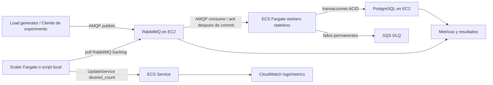

# Plan paso a paso - Practica Ticket Service con Terraform en AWS Academy

Fecha: 2026-06-07

Este documento convierte el enunciado en un plan de trabajo ejecutable. La prioridad es cumplir lo obligatorio: correccion bajo concurrencia, procesamiento asincrono con RabbitMQ en EC2, workers stateless en Fargate o Lambda, persistencia en PostgreSQL/MySQL en EC2, escalado dinamico, mediciones fiables y reporte final con analisis.

## 1. Lectura del enunciado y decisiones base

### Requisitos obligatorios detectados

- Sistema distribuido de venta de tickets usando servicios AWS gestionados cuando aplique.
- Dos modos funcionales:
  - Tickets no numerados con maximo 100000 tickets.
  - Tickets numerados con asientos 1 a 100000.
- No puede haber overselling.
- Hay que definir explicitamente el modelo de consistencia.
- Hay que explicar como se evitan race conditions.
- Comunicacion asincrona obligatoria con cola, concretamente RabbitMQ en una VM EC2 es una opcion indicada por el enunciado.
- Workers stateless obligatorios usando Lambda o Fargate.
- Persistencia obligatoria usando PostgreSQL o MySQL en VM EC2.
- Cada compra debe incluir un retardo artificial de 100 ms dentro de la logica del worker.
- El escalado dinamico debe basarse en carga medida experimentalmente.
- Hay que demostrar elasticidad con carga variable Z(t).
- Hay que hacer stress testing y analisis de capacidad.
- Hay que evaluar carga uniforme y carga hotspot: 80% de peticiones sobre 5% de asientos.
- El throughput debe calcularse con transacciones completadas, no solo con tiempo del cliente.
- Hay que implementar tolerancia a fallos: fallo de worker, idempotencia con request_id, reintentos seguros, semantica at-least-once y DLQ SQS.
- La infraestructura debe desplegarse con un comando y sin configuracion manual.
- Hay que entregar codigo, guia de despliegue y reporte final con graficas.

### Decision principal de arquitectura

Usaremos Terraform como IaC principal y AWS Academy como entorno objetivo.

Arquitectura propuesta:



Razonamiento:

- RabbitMQ cumple comunicacion indirecta/asincrona: desacopla productor y workers en espacio y tiempo, suaviza picos y permite backpressure.
- Fargate cumple workers stateless y permite variar `desired_count` dinamicamente.
- PostgreSQL en EC2 permite transacciones ACID, constraints unicas y locks row-level para no vender dos veces.
- SQS se usa como DLQ obligatoria, sin reemplazar RabbitMQ como cola principal.
- Terraform evita el problema de CDK bootstrap detectado en AWS Academy.

## 2. Restricciones especificas de AWS Academy

Datos detectados en `documents/aws_academy_hallazgos_probe.md`:

- Cuenta: `065586234233`.
- Region objetivo: `us-east-1`.
- Presupuesto aproximado: 50 USD.
- Sesion aproximada: 4 horas.
- Existe VPC default `vpc-0b379683405b06ceb` con subnets publicas y `MapPublicIpOnLaunch = true`.
- EC2 funciona en pruebas previas.
- SQS responde correctamente.
- ECS/Fargate es visible, pero falta validar creacion real de servicios.
- ECR existente: `ticket-worker`.
- CDK bootstrap estandar fallo; no usar CDK para esta practica.

Implicaciones de diseno:

- Usar `us-east-1`.
- Reutilizar VPC default para reducir permisos, coste y tiempo.
- Evitar NAT Gateway y Load Balancers salvo necesidad estricta.
- Usar instancias pequenas: `t2.micro` o `t3.micro` si esta disponible.
- Usar volumenes EBS pequenos, `gp3`, `delete_on_termination = true`.
- Ejecutar `terraform destroy` al terminar cada sesion de laboratorio.
- Preferir Fargate en subnets publicas con `assign_public_ip = true` para evitar NAT.
- Reutilizar o crear ECR de forma explicita, sin mecanismos de asset publishing de CDK.

## 3. Hito 0 - Preparacion del repositorio

Objetivo: dejar una estructura clara para infraestructura, aplicacion, pruebas y reporte.

Estructura propuesta:

```text
pracSD/
  documents/
    enunciado.txt
    aws_academy_hallazgos_probe.md
    teoria/
    plan_practica_terraform_aws_academy.md
  infra/
    terraform/
      main.tf
      providers.tf
      variables.tf
      outputs.tf
      versions.tf
      terraform.tfvars.example
      modules/
        network/
        security/
        rabbitmq_ec2/
        postgres_ec2/
        ecr/
        ecs_workers/
        sqs_dlq/
        monitoring/
  app/
    worker/
      Dockerfile
      src/
      requirements.txt o package.json
    loadgen/
      src/
      requirements.txt o package.json
    scaler/
      src/
      requirements.txt o package.json
  scripts/
    set-academy-env.ps1
    deploy.ps1
    destroy.ps1
    build-push-worker.ps1
    run-experiment.ps1
    collect-results.ps1
  report/
    final_report.md
    figures/
    data/
```

Tareas:

1. Crear estructura de carpetas.
2. Elegir lenguaje de implementacion. Recomendacion: Python por rapidez para RabbitMQ, PostgreSQL, AWS SDK, generacion de carga y analisis con pandas/matplotlib.
3. Definir convenciones de configuracion por variables de entorno.
4. Preparar `.gitignore` para evitar subir credenciales, `.tfstate`, `.tfvars`, CSV grandes y claves.
5. Crear README minimo con comandos principales.

Criterio de salida:

- El repositorio tiene una estructura lista para implementar.
- No hay secretos versionados.

## 4. Hito 1 - Smoke tests de Terraform en AWS Academy

Objetivo: comprobar permisos reales antes de construir todo.

Tareas:

1. Cargar credenciales AWS Academy con el script existente o crear uno equivalente.
2. Verificar identidad:

```powershell
aws sts get-caller-identity
```

3. Crear un Terraform minimo que lea:

- Region `us-east-1`.
- VPC default.
- Subnets default.
- Security group temporal.
- Cola SQS temporal.

4. Ejecutar:

```powershell
terraform init
terraform plan
terraform apply -auto-approve
terraform destroy -auto-approve
```

5. Probar si Terraform puede crear o reutilizar roles IAM necesarios para ECS:

- Primero intentar usar rol existente de AWS Academy, normalmente `LabRole`, como `task_role_arn` y `execution_role_arn` si tiene permisos suficientes.
- Si no sirve, intentar crear roles minimos de ECS Task Execution solo si la cuenta lo permite.

Criterio de salida:

- Terraform puede crear y destruir recursos basicos.
- Hay una decision documentada sobre IAM: reutilizar `LabRole` o crear roles minimos.

Riesgo:

- Si IAM bloquea roles ECS, Fargate puede ser el punto critico. En ese caso se mantiene Terraform y se ajusta usando roles existentes del laboratorio.

## 5. Hito 2 - Infraestructura base con Terraform

Objetivo: desplegar los recursos minimos necesarios sin aplicacion completa.

### Recursos Terraform

1. Provider AWS:

- Region fija por variable: `us-east-1`.
- Perfil/credenciales cargadas desde entorno.

2. Network:

- `data.aws_vpc.default`.
- `data.aws_subnets.default`.
- No crear VPC propia.
- No crear NAT Gateway.

3. Security groups:

- `sg_rabbitmq`:
  - Entrada AMQP `5672` desde security group de workers y desde `operator_cidr` para generador local.
  - Entrada UI `15672` solo desde `operator_cidr`.
  - SSH `22` desactivado por defecto. Activarlo solo si es imprescindible y restringido.
- `sg_postgres`:
  - Entrada `5432` solo desde workers y, opcionalmente, desde `operator_cidr` para depuracion.
- `sg_workers`:
  - Egress permitido a Internet y a servicios internos.
  - Sin inbound.

4. RabbitMQ EC2:

- Instancia pequena Amazon Linux 2023.
- User data instala Docker y ejecuta `rabbitmq:3-management`.
- Usuario/password definidos por variables Terraform o `random_password`.
- Datos persistentes en `/opt/rabbitmq` sobre EBS.
- Health check simple desde Terraform outputs o script.

5. PostgreSQL EC2:

- Instancia pequena Amazon Linux 2023.
- User data instala Docker y ejecuta PostgreSQL.
- Datos persistentes en `/opt/postgres/data`.
- Base de datos `tickets`.
- Usuario/password definidos por variables Terraform o `random_password`.
- Script de inicializacion SQL versionado.

6. ECR:

- Reutilizar repo `ticket-worker` si existe o crearlo con Terraform.
- Activar scan on push si permisos lo permiten.

7. ECS/Fargate:

- Cluster ECS.
- Task definition para worker.
- Service con `desired_count` inicial 1.
- CPU/memoria inicial: 0.25 vCPU / 512 MB.
- Public subnets con `assign_public_ip = true`.
- Variables de entorno para conectar a RabbitMQ, PostgreSQL y SQS DLQ.
- Logs a CloudWatch.

8. SQS DLQ:

- Cola `ticket-failures-dlq`.
- Usada por workers para errores definitivos tras max retries.

9. Monitoring:

- Log groups CloudWatch para workers y scaler.
- Outputs con endpoints, nombres de cola, cluster y service.

Criterio de salida:

- `terraform apply` levanta todos los recursos.
- `terraform destroy` los elimina sin residuos relevantes.
- Se puede acceder a RabbitMQ UI desde `operator_cidr`.
- PostgreSQL acepta conexion desde workers.

## 6. Hito 3 - Modelo de datos PostgreSQL

Objetivo: implementar correccion por transacciones ACID y constraints.

### Tablas propuestas

```sql
CREATE TABLE experiment_runs (
  run_id UUID PRIMARY KEY,
  workload_name TEXT NOT NULL,
  mode TEXT NOT NULL CHECK (mode IN ('unnumbered', 'numbered')),
  started_at TIMESTAMPTZ NOT NULL,
  completed_at TIMESTAMPTZ,
  expected_requests INTEGER,
  notes TEXT
);

CREATE TABLE ticket_pools (
  pool_id TEXT PRIMARY KEY,
  total_tickets INTEGER NOT NULL CHECK (total_tickets > 0),
  sold_count INTEGER NOT NULL DEFAULT 0 CHECK (sold_count >= 0),
  CHECK (sold_count <= total_tickets)
);

CREATE TABLE seats (
  seat_id INTEGER PRIMARY KEY CHECK (seat_id BETWEEN 1 AND 100000),
  status TEXT NOT NULL CHECK (status IN ('available', 'sold')),
  request_id UUID UNIQUE,
  sold_at TIMESTAMPTZ
);

CREATE TABLE requests (
  request_id UUID PRIMARY KEY,
  run_id UUID REFERENCES experiment_runs(run_id),
  mode TEXT NOT NULL CHECK (mode IN ('unnumbered', 'numbered')),
  seat_id INTEGER,
  status TEXT NOT NULL,
  attempts INTEGER NOT NULL DEFAULT 0,
  enqueued_at TIMESTAMPTZ NOT NULL,
  worker_started_at TIMESTAMPTZ,
  completed_at TIMESTAMPTZ,
  result TEXT,
  error TEXT
);

CREATE TABLE sales (
  sale_id BIGSERIAL PRIMARY KEY,
  request_id UUID NOT NULL UNIQUE REFERENCES requests(request_id),
  mode TEXT NOT NULL CHECK (mode IN ('unnumbered', 'numbered')),
  seat_id INTEGER UNIQUE,
  sold_at TIMESTAMPTZ NOT NULL
);
```

### Inicializacion de datos

- Insertar `ticket_pools('main', 100000, 0)`.
- Insertar asientos 1..100000 en `seats` con estado `available`.
- Crear indices en `requests(run_id)`, `requests(completed_at)`, `sales(sold_at)`.

Criterio de salida:

- La base queda preparada con 100000 tickets no numerados y 100000 asientos numerados.
- Las constraints impiden overselling aunque haya errores de aplicacion.

## 7. Hito 4 - Logica del worker stateless

Objetivo: procesar mensajes de compra con seguridad ante concurrencia y reintentos.

### Flujo general del worker

1. Consumir mensaje de RabbitMQ con manual ack.
2. Leer payload:

```json
{
  "request_id": "uuid",
  "run_id": "uuid",
  "mode": "numbered|unnumbered",
  "seat_id": 123,
  "enqueued_at": "timestamp",
  "attempt": 1
}
```

3. Registrar o actualizar `requests` por `request_id`.
4. Aplicar retardo artificial de 100 ms dentro de la logica del worker.
5. Ejecutar transaccion ACID de venta.
6. Confirmar RabbitMQ con `ack` solo despues de commit.
7. Si hay error transitorio, `nack` con requeue y aumentar intento.
8. Si se supera `MAX_ATTEMPTS`, enviar evento a SQS DLQ, registrar error y `ack` para no bloquear la cola.

### Compra no numerada

Modelo recomendado:

```sql
BEGIN;

INSERT INTO requests (...) VALUES (...)
ON CONFLICT (request_id) DO UPDATE SET attempts = requests.attempts + 1
RETURNING status;

-- Si ya esta completed, devolver resultado idempotente y COMMIT.

UPDATE ticket_pools
SET sold_count = sold_count + 1
WHERE pool_id = 'main'
  AND sold_count < total_tickets
RETURNING sold_count;

INSERT INTO sales(request_id, mode, sold_at)
VALUES (:request_id, 'unnumbered', now());

UPDATE requests
SET status = 'completed', result = 'sold', completed_at = now()
WHERE request_id = :request_id;

COMMIT;
```

Garantia:

- PostgreSQL serializa la actualizacion de la fila `ticket_pools`.
- `sold_count <= total_tickets` queda protegido por condicion e invariant check.
- `request_id` unico garantiza idempotencia.

### Compra numerada

Modelo recomendado:

```sql
BEGIN;

INSERT INTO requests (...) VALUES (...)
ON CONFLICT (request_id) DO UPDATE SET attempts = requests.attempts + 1
RETURNING status;

-- Si ya esta completed, devolver resultado idempotente y COMMIT.

UPDATE seats
SET status = 'sold', request_id = :request_id, sold_at = now()
WHERE seat_id = :seat_id
  AND status = 'available'
RETURNING seat_id;

INSERT INTO sales(request_id, mode, seat_id, sold_at)
VALUES (:request_id, 'numbered', :seat_id, now());

UPDATE requests
SET status = 'completed', result = 'sold', completed_at = now()
WHERE request_id = :request_id;

COMMIT;
```

Garantia:

- Cada fila de asiento se vende como maximo una vez por condicion `status = 'available'`.
- `sales.seat_id UNIQUE` actua como segunda barrera contra duplicados.
- Reintentos del mismo `request_id` no generan ventas duplicadas.

### Modelo de consistencia que se documentara

- Consistencia fuerte para el estado de ventas.
- La fuente de verdad es una unica instancia PostgreSQL primaria.
- Las ventas se confirman solo tras commit ACID.
- La cola RabbitMQ da entrega at-least-once, no exactly-once.
- La combinacion correcta es at-least-once en mensajeria + idempotencia y transacciones en base de datos.
- No se usara consistencia eventual para decidir ventas porque permitiria lecturas obsoletas y conflictos de asiento.

Criterio de salida:

- Tests locales o unitarios prueban que dos workers no pueden vender el mismo asiento.
- Reprocesar el mismo `request_id` devuelve el mismo resultado sin duplicar venta.

## 8. Hito 5 - RabbitMQ y semantica de cola

Objetivo: configurar la cola principal, retries y DLQ sin reemplazar RabbitMQ por SQS.

Recursos RabbitMQ:

- Exchange principal: `tickets.exchange`.
- Queue principal durable: `tickets.buy`.
- Routing key: `ticket.buy`.
- Exchange de errores RabbitMQ: `tickets.dlx`.
- Queue interna de errores RabbitMQ: `tickets.failed.rabbit`.

Politica de mensajes:

- Mensajes persistentes.
- Consumer manual ack.
- Prefetch por worker configurable, recomendado inicial: `prefetch=1` o `prefetch=2` por el retardo de 100 ms y para repartir carga justamente.
- Ack despues del commit en PostgreSQL.
- Nack/requeue para fallos transitorios.
- Tras `MAX_ATTEMPTS`, enviar a SQS DLQ y ack.

SQS DLQ:

- Cola `ticket-failures-dlq` recibe JSON con `request_id`, `run_id`, payload original, error, attempts y timestamp.
- En el reporte se explicara que SQS es DLQ de fallos definitivos, no la cola de trabajo principal.

Criterio de salida:

- Si un worker muere antes de ack, RabbitMQ redelivery ocurre.
- Si el mensaje ya estaba comprometido en PostgreSQL, el reintento es idempotente.
- Si un mensaje falla repetidamente, queda en SQS DLQ.

## 9. Hito 6 - Load generator y definicion de Z(t)

Objetivo: generar carga controlada para elasticidad, stress testing y escenarios de contencion.

### Load generator

Implementacion recomendada:

- Python async o multiproceso.
- Publica mensajes AMQP en RabbitMQ.
- Genera `request_id` unico por intento logico.
- Escribe un registro local CSV de mensajes enviados para validacion, pero las metricas oficiales saldran de PostgreSQL.
- Permite fijar seed aleatoria para reproducibilidad.

Parametros:

- `--mode unnumbered|numbered`.
- `--run-id uuid`.
- `--duration-seconds`.
- `--profile z_elastic|stress|uniform|hotspot`.
- `--rate` o funcion de tasa por segundo.
- `--total-requests`.
- `--duplicate-rate` para probar idempotencia.

### Z(t) para elasticidad

Perfil inicial, ajustable tras medicion de capacidad:

| Fase | Duracion | Carga objetivo | Objetivo |
|---|---:|---:|---|
| Low load | 30 s | 20 req/s | Ver estado estable con pocos workers |
| Ramp-up gradual | 60 s | 20 -> 150 req/s | Observar escalado progresivo |
| Sudden spike | 30 s | 400 req/s | Provocar backlog y escalado rapido |
| Sustained high load | 120 s | 250 req/s | Medir estabilidad sostenida |
| Cool-down | 60 s | 250 -> 20 req/s | Ver scale down y evitar overprovisioning |

Nota: estos valores se calibraran con `C`, la capacidad real por worker. Si AWS Academy o el presupuesto limitan Fargate, se bajaran las tasas manteniendo la forma de Z(t).

### Carga uniforme

- Para modo numerado, elegir `seat_id` uniformemente entre 1 y 100000.
- Para no numerado, no hay asiento especifico.

### Carga hotspot

- 80% de peticiones apuntan al 5% de asientos: asientos 1..5000.
- 20% restante se distribuye en 5001..100000.

Criterio de salida:

- Se pueden ejecutar perfiles reproducibles.
- Cada experimento tiene `run_id`, timestamps y parametros guardados.

## 10. Hito 7 - Escalado dinamico

Objetivo: implementar escalado real de Fargate basado en carga medida.

### Medicion experimental de capacidad C

Antes del escalado dinamico:

1. Ejecutar con 1 worker.
2. Generar carga suficientemente alta pero estable.
3. Medir throughput completado desde PostgreSQL.
4. Calcular capacidad por worker:

```text
C = completed_requests / total_time_seconds
```

Con retardo de 100 ms, limite teorico por worker secuencial:

```text
C_teorico ~= 1 / 0.100 = 10 req/s
```

El valor real sera menor por coste de AMQP, PostgreSQL, red y logs. Si cada task usa concurrencia interna mayor que 1, hay que medir C por task, no por thread.

### Formula de escalado

Usaremos backlog como senal principal:

```text
N_backlog = ceil(B / (Tr * C))
```

Donde:

- `B` = mensajes esperando en RabbitMQ.
- `Tr` = tiempo objetivo para drenar backlog, por ejemplo 30 s.
- `C` = capacidad experimental por worker/task.

Tambien se calculara una estimacion por llegada:

```text
N_arrival = ceil(lambda / C)
```

Donde:

- `lambda` = tasa de llegada medida en mensajes/s.

Decision final:

```text
N = clamp(max(N_backlog, N_arrival), min_workers, max_workers)
```

Valores iniciales:

- `min_workers = 1`.
- `max_workers = 8` para controlar coste.
- `scale_up_cooldown = 15 s`.
- `scale_down_cooldown = 60 s`.
- `Tr = 30 s`.

### Implementacion del scaler

Opcion A, preferida:

- Servicio Fargate `ticket-scaler` con 1 task.
- Poll cada 10 s a RabbitMQ Management API.
- Lee backlog de `tickets.buy`.
- Calcula `lambda` comparando mensajes publicados entre ventanas.
- Llama `ecs.update_service(desiredCount=N)`.
- Publica metricas a CloudWatch o PostgreSQL.

Opcion B, fallback si IAM bloquea ECS update desde Fargate:

- Script local `scripts/run-scaler.ps1` durante experimentos.
- Hace la misma logica y usa AWS CLI local con credenciales Academy.
- Sigue siendo escalado dinamico basado en carga real, pero se documentara como fallback por restricciones del laboratorio.

Criterio de salida:

- Durante Z(t), `desired_count` sube y baja automaticamente.
- El backlog no crece indefinidamente en carga sostenible.
- El reporte incluye grafica backlog vs tiempo y workers vs tiempo.

## 11. Hito 8 - Medicion correcta de throughput y latencia

Objetivo: evitar el error indicado en el enunciado: medir solo desde el cliente.

Metricas oficiales:

- Inicio del experimento: `experiment_runs.started_at`.
- Fin del experimento: timestamp maximo de `requests.completed_at` para ese `run_id` cuando se completan todas las peticiones esperadas o se alcanza timeout.
- Throughput:

```text
throughput = completed_successful_requests / (last_completed_at - started_at)
```

- Latencia end-to-end:

```text
completed_at - enqueued_at
```

- Latencia de procesamiento del worker:

```text
completed_at - worker_started_at
```

- Percentiles requeridos:

```text
p50, p95, p99
```

- Backlog RabbitMQ por tiempo.
- Desired workers por tiempo.
- Errores y DLQ por tiempo.

Consultas SQL base:

```sql
SELECT count(*) AS completed
FROM requests
WHERE run_id = :run_id AND status = 'completed';

SELECT
  percentile_cont(0.50) WITHIN GROUP (ORDER BY extract(epoch FROM (completed_at - enqueued_at))) AS p50,
  percentile_cont(0.95) WITHIN GROUP (ORDER BY extract(epoch FROM (completed_at - enqueued_at))) AS p95,
  percentile_cont(0.99) WITHIN GROUP (ORDER BY extract(epoch FROM (completed_at - enqueued_at))) AS p99
FROM requests
WHERE run_id = :run_id AND completed_at IS NOT NULL;
```

Graficas obligatorias:

- Throughput vs workers.
- Queue backlog vs time.
- Latency percentiles.

Graficas recomendadas adicionales:

- Desired workers vs time.
- Arrival rate vs completion rate.
- Error/DLQ count vs time.
- Uniform vs hotspot latency/throughput.

Criterio de salida:

- `scripts/collect-results.ps1` exporta CSV desde PostgreSQL y RabbitMQ/scaler.
- `report/figures` contiene PNGs con etiquetas claras.

## 12. Hito 9 - Stress testing y capacidad

Objetivo: determinar capacidad maxima, punto de saturacion y degradacion.

Metodologia:

1. Fijar numero de workers: 1, 2, 4, 8.
2. Para cada valor, generar carga por niveles: 5, 10, 20, 40, 80, 160, 320 req/s o valores calibrados.
3. Mantener cada nivel 60-120 s.
4. Registrar:

- Throughput completado.
- Backlog final y maximo.
- p50/p95/p99.
- CPU/memoria ECS si CloudWatch lo permite.
- CPU de EC2 PostgreSQL/RabbitMQ si se puede obtener.
- Errores y DLQ.

Criterios para detectar saturacion:

- Backlog crece de forma sostenida.
- p95/p99 crecen sin estabilizarse.
- Throughput deja de aumentar aunque suba la tasa de llegada.
- Aumentan timeouts, reintentos o errores DB.

Salida esperada:

- Tabla de capacidad por workers.
- Identificacion de cuello de botella: retardo artificial, PostgreSQL, RabbitMQ, Fargate cold start/scale out, red o locks por hotspot.
- Grafica throughput vs workers para estimar speedup:

```text
S = T1 / TN
```

## 13. Hito 10 - Escenarios de contencion

Objetivo: probar uniform load y hotspot load como pide el enunciado.

### Experimento A: uniforme

- Modo: numbered.
- Seats: seleccion uniforme 1..100000.
- Workers: dinamico o valores fijos para comparar.
- Medir ventas exitosas, intentos fallidos por asiento ya vendido, latencias y locks.

### Experimento B: hotspot

- Modo: numbered.
- 80% de peticiones a 5% de asientos.
- Misma tasa y duracion que uniforme.
- Comparar p95/p99 y throughput.

Hipotesis esperada:

- Hotspot aumenta conflictos de actualizacion y ventas rechazadas por asiento ya vendido.
- Si la implementacion usa row-level updates y unique constraints, se mantiene la correccion aunque baje el rendimiento.
- La cola puede acumular backlog si los retries se gestionan mal; por eso los fallos de asiento ya vendido deben tratarse como resultado definitivo, no como error transitorio.

Criterio de salida:

- Reporte incluye comparacion uniforme vs hotspot.
- Se demuestra que no hay duplicados en `sales.seat_id`.

## 14. Hito 11 - Tolerancia a fallos

Objetivo: demostrar fallo de worker, idempotencia, retries y DLQ.

Pruebas:

1. Duplicados intencionales:

- Publicar el mismo `request_id` varias veces.
- Esperado: una sola venta, multiples procesamientos idempotentes.

2. Crash antes de ack:

- Inyectar fallo despues de commit y antes de ack.
- RabbitMQ redelivera el mensaje.
- Esperado: el segundo procesamiento detecta `request_id` completado y hace ack sin duplicar.

3. Error transitorio:

- Simular desconexion temporal a PostgreSQL o error artificial.
- Esperado: nack/requeue hasta `MAX_ATTEMPTS`.

4. Error permanente:

- Payload invalido o seat_id fuera de rango.
- Esperado: registro como failed y envio a SQS DLQ.

5. Worker scale-in:

- Reducir desired_count durante carga.
- Esperado: no se pierden mensajes; mensajes no acked se reprocesan.

Criterio de salida:

- Hay logs y consultas SQL que prueban cada caso.
- SQS DLQ contiene fallos definitivos.

## 15. Hito 12 - Reporte final

Objetivo: preparar desde el principio la estructura exigida.

Estructura propuesta:

```text
1. Table of Contents
2. Introduction and objectives
3. Requirements mapping
4. Architecture
5. Infrastructure as Code with Terraform
6. Data model and correctness
7. Consistency model and concurrency control
8. Fault tolerance design
9. Dynamic scaling model
10. Experimental setup
11. Workload Z(t)
12. Stress testing and capacity analysis
13. Uniform vs hotspot contention analysis
14. Results and validation plots
15. Bottlenecks and trade-offs
16. Conceptual questions
17. AI usage
18. Deployment guide
19. Cleanup guide
20. Appendix: commands, SQL queries, Terraform outputs
```

Preguntas conceptuales que deben quedar contestadas:

- Q1 Consistency vs Scalability:
  - Modelo elegido: fuerte para ventas via PostgreSQL ACID.
  - Por que: no overselling requiere serializacion de operaciones conflictivas.
  - Si se cambiara a eventual: mejor disponibilidad/latencia potencial, pero riesgo de ventas duplicadas o conflictos que habria que compensar.
  - Si se endureciera mas: mas bloqueos/coordinacion y menor throughput.

- Q2 Fault Tolerance vs Performance:
  - Retries e idempotencia aumentan escritura, lecturas y logs.
  - DLQ evita bloqueo por mensajes venenosos.
  - At-least-once implica posible trabajo duplicado.
  - Mas fiabilidad puede reducir throughput si los reintentos saturan DB/cola.

Criterio de salida:

- El reporte cumple todos los apartados estrictos.
- Las graficas tienen etiquetas e interpretacion, no solo imagenes.

## 16. Hito 13 - Automatizacion de un comando

Objetivo: cumplir despliegue sin setup manual.

Comando objetivo:

```powershell
.\scripts\deploy.ps1
```

Responsabilidades de `deploy.ps1`:

1. Cargar credenciales AWS Academy desde `tools/aws/set-academy-env.ps1` si existe o pedir ruta.
2. Validar `aws sts get-caller-identity`.
3. Ejecutar `terraform init`.
4. Ejecutar `terraform apply -auto-approve`.
5. Construir imagen Docker del worker.
6. Login en ECR.
7. Push de imagen.
8. Forzar nuevo deployment ECS.
9. Esperar health checks basicos.
10. Mostrar outputs: RabbitMQ URL, DB endpoint, ECS cluster/service, SQS DLQ URL.

Comando de limpieza:

```powershell
.\scripts\destroy.ps1
```

Responsabilidades de `destroy.ps1`:

1. Confirmar cuenta AWS.
2. Vaciar o conservar ECR segun variable.
3. Ejecutar `terraform destroy -auto-approve`.
4. Verificar que no quedan instancias EC2, colas SQS o servicios ECS del proyecto.

Criterio de salida:

- Despliegue reproducible con un comando.
- Destruccion reproducible para no consumir presupuesto.

## 17. Orden recomendado de implementacion

1. Crear estructura de repositorio y `.gitignore`.
2. Implementar Terraform smoke test.
3. Implementar modulos Terraform de network/security/SQS.
4. Implementar RabbitMQ EC2 con user data.
5. Implementar PostgreSQL EC2 con user data y schema SQL.
6. Implementar ECR y pipeline build/push.
7. Implementar ECS Fargate worker minimo que arranca y loguea config.
8. Implementar worker real con RabbitMQ + PostgreSQL.
9. Implementar load generator.
10. Implementar consultas de metricas y export CSV.
11. Implementar scaler dinamico.
12. Ejecutar pruebas de correccion e idempotencia.
13. Ejecutar stress tests con workers fijos.
14. Calibrar `C` y parametros de escalado.
15. Ejecutar Z(t) con escalado dinamico.
16. Ejecutar uniforme vs hotspot.
17. Generar graficas.
18. Completar reporte final.
19. Validar despliegue limpio desde cero.
20. Destruir recursos al terminar.

## 18. Riesgos y mitigaciones

| Riesgo | Impacto | Mitigacion |
|---|---|---|
| AWS Academy bloquea creacion de IAM roles | Fargate no despliega | Reutilizar `LabRole`; probar al inicio |
| Fargate/ECR no permite push o pull | Workers no arrancan | Reutilizar ECR existente; validar con imagen minima |
| NAT Gateway costoso | Gasto innecesario | Usar subnets publicas y `assign_public_ip = true` |
| EC2 queda encendida fuera de uso | Consume presupuesto | `destroy.ps1` y checklist de limpieza |
| RabbitMQ o PostgreSQL single-node fallan | Menor disponibilidad | Aceptar para practica por coste; documentar trade-off |
| Hotspot genera muchas colisiones | Latencia alta | Tratar asiento vendido como resultado final, no retry |
| Retardo 100 ms limita throughput | Necesita mas workers | Medir C real y escalar con backlog/lambda |
| Medicion cliente incorrecta | Penalizacion en reporte | Usar DB como fuente oficial de completados |
| Estado Terraform contiene secretos | Riesgo seguridad | No versionar tfstate/tfvars; usar random_password y entorno local |

## 19. Checklist de cumplimiento del enunciado

- [ ] Soporte tickets no numerados con maximo 100000.
- [ ] Soporte tickets numerados 1..100000.
- [ ] Sin overselling probado por SQL y tests concurrentes.
- [ ] Modelo de consistencia fuerte documentado.
- [ ] Race conditions prevenidas con transacciones, row-level updates y unique constraints.
- [ ] RabbitMQ en EC2 como cola asincrona principal.
- [ ] Workers stateless en ECS Fargate.
- [ ] PostgreSQL en EC2 como almacenamiento persistente.
- [ ] Retardo artificial de 100 ms dentro del worker.
- [ ] Escalado dinamico basado en backlog/lambda medidos.
- [ ] Carga Z(t): low, ramp-up, spike, high, cool-down.
- [ ] Stress tests hasta saturacion.
- [ ] Uniform load evaluado.
- [ ] Hotspot load 80/5 evaluado.
- [ ] Throughput calculado con completados en PostgreSQL.
- [ ] Latencias p50/p95/p99 calculadas con metrica end-to-end valida sin clock skew.
- [ ] Fallo de worker probado.
- [ ] Idempotencia por `request_id` probada.
- [ ] Retries seguros con at-least-once.
- [ ] SQS DLQ implementada.
- [ ] Terraform despliega la infraestructura.
- [ ] Un comando de deploy.
- [ ] Un comando de destroy.
- [ ] Reporte con TOC.
- [ ] Diagramas de arquitectura.
- [ ] Graficas: throughput vs workers, backlog vs time, latency percentiles.
- [ ] Analisis de bottlenecks, scaling y trade-offs.
- [ ] Seccion de uso de IA.

## 20. Primera sesion practica recomendada

Objetivo de la siguiente sesion: validar que Terraform + ECS/Fargate funcionan en AWS Academy antes de invertir en toda la app.

Pasos concretos:

1. Crear `infra/terraform` minimo con provider, VPC default, SQS y outputs.
2. Aplicar y destruir.
3. Crear ECR o leer `ticket-worker` existente.
4. Construir imagen Docker minima que imprime `hello worker`.
5. Crear ECS cluster, task definition y service de 1 task.
6. Confirmar logs en CloudWatch.
7. Destruir todo.

Si esto funciona, el proyecto queda desbloqueado. Si falla, el plan se ajusta especificamente al permiso que bloquee AWS Academy.

## 21. Prioridad Alta - End-to-End Correcto

El enunciado exige `End-to-end processing time` y advierte que no se debe depender solo del timing del cliente. La medicion actual `completed_at - enqueued_at` no es valida porque mezcla reloj local y reloj AWS/PostgreSQL.

Antes de stress tests, graficas o escalado hay que corregir esto.

Accion requerida:

1. Anadir timestamp server-side de entrada, por ejemplo `received_at TIMESTAMPTZ` en `requests`.
2. Guardarlo en el worker con `clock_timestamp()` al recibir/procesar el mensaje.
3. Exportar percentiles usando timestamps del mismo reloj.
4. Documentar claramente que metrica representa cada campo:
   - `processing_seconds`: tiempo de worker/transaccion.
   - `server_end_to_end_seconds`: recepcion server-side hasta commit.
   - `client_end_to_end_seconds`: solo informativo si depende del reloj local.

Criterio de salida:

- Ninguna latencia end-to-end usada en el informe puede salir negativa por clock skew.
- Los CSV deben incluir una metrica end-to-end defendible y alineada con el enunciado.

## 22. Regla Operativa - Revisar Enunciado

Antes de cada nuevo paso:

1. Revisar el apartado relevante de `documents/enunciado.txt`.
2. Confirmar que el paso contribuye a un requisito concreto.
3. Registrar en el diario que requisito cubre.

